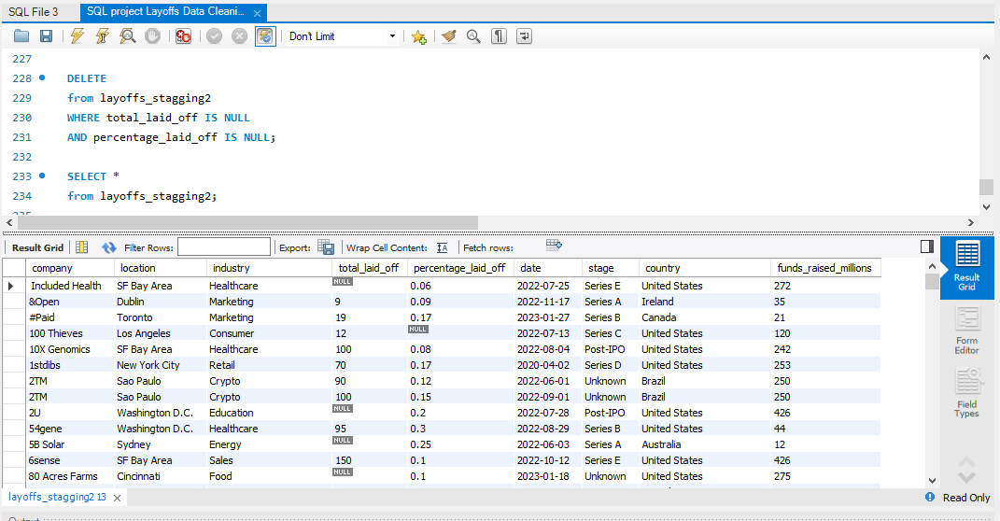

# SQL Data Cleaning Project – World Layoffs Dataset

## Final Cleaned Dataset

## Project Overview

This project demonstrates a complete SQL data cleaning workflow using the World Layoffs dataset. The objective was to transform raw, inconsistent data into a clean and reliable dataset that can be used for further analysis and reporting.

The project was completed using MySQL and follows real-world data cleaning practices such as removing duplicates, standardizing data, handling missing values, and formatting date columns.

## Business Problem

Raw datasets often contain:

- Duplicate records
- Inconsistent formatting
- Missing values
- Blank values
- Incorrect data types

These issues reduce data quality and can lead to inaccurate analysis. The goal of this project was to improve data quality while preserving as much useful information as possible.

## Tools Used

- MySQL
- MySQL Workbench
- SQL

## Dataset

Dataset Name: World Layoffs Dataset

The dataset contains information about layoffs across different companies, including:

- Company
- Industry
- Country
- Location
- Total Laid Off
- Percentage Laid Off
- Date
- Funding Stage

## Data Cleaning Process

The following steps were performed:

### 1. Created a Staging Table

- Created a copy of the original dataset.
- Preserved the raw data.

### 2. Removed Duplicate Records

- Used ROW_NUMBER()
- Used PARTITION BY
- Removed duplicate rows safely

### 3. Standardized the Data

- Removed extra spaces using TRIM()
- Standardized text values
- Converted blank strings into NULL values

### 4. Converted Date Format

- Converted text dates into proper DATE format using STR_TO_DATE()
- Modified the column datatype to DATE

### 5. Handled Missing Values

- Used Self Join
- Filled missing industry values using existing company information
- Avoided guessing missing values

 ### 6. Removed Unnecessary Records

- Deleted only rows that contained no meaningful analytical information.

##  SQL Concepts Used

- CREATE TABLE
- UPDATE
- DELETE
- ALTER TABLE
- TRIM()
- ROW_NUMBER()
- PARTITION BY
- Common Table Expressions (CTEs)
- Self Join
- CASE Logic
- STR_TO_DATE()
- NULL Handling

## Project Outcome

Successfully transformed raw data into a clean dataset suitable for exploratory data analysis and reporting.

## Skills Demonstrated

- Data Cleaning
- SQL
- Data Standardization
- Data Validation
- Handling Missing Values
- Duplicate Removal
- Data Quality Improvement
- Problem Solving

## Project Screenshots

Screenshots of the cleaning process and final output are available in the Images folder.

## Author

Kaushikee Sharma

Aspiring Data Analyst
